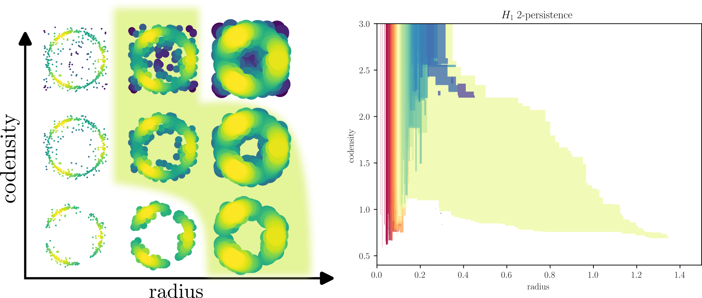
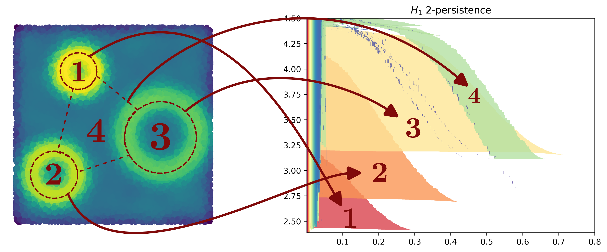
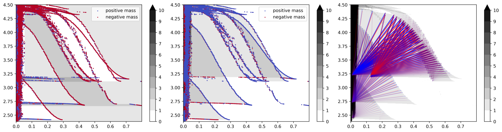

# multipers : Multiparameter Persistence for Machine Learning
[](https://pypi.org/project/multipers)
[](https://pepy.tech/project/multipers)
[Documentation](https://www-sop.inria.fr/members/David.Loiseaux/doc/multipers/index.html)
<br>
Scikit-style PyTorch-autodiff multiparameter persistent homology python library. 
This library aims to provide easy to use and performant strategies for applied multiparameter topology.
<br> Meant to be integrated in [the Gudhi library](https://gudhi.inria.fr/).

## Multiparameter Persistence
This library allows to compute several representation from "geometrical datasets", e.g., point clouds, images, graphs, that have multiple scales. A well known example is is the following one. 
<br>
Pick a point cloud that has diffuse noise, or on which the sampling measure has some interesting properties, e.g., in the following example the measure has three modes.
<br>
Now define a two parameter grid (filtration) of topological spaces (on the left) from a point cloud $P$ on which we will compute the persistence of some topological structures (homological cycles).
This filtration $X$, indexed over a radius parameter $r$ and a codensity parameter $s$ is defined as follows

$$ X_{r,s} = \bigcup_{x \in P, \, \mathrm{density}(x) \ge s} B(x,r) = \lbrace x\in \mathbb R^2 \mid \exists p \in P, \, \mathrm{density}(p) \ge s \text{ and } d(x,p) \le r \rbrace$$

The green shape on the left represent the lifetime of the biggest annulus. On the right, each cycle appearing on the left gets a colored shape (the color is only a label) and the shape of this colored shape represents the lifetime of this cycle.
<br>
In our case, the big green shape on the left corresponds to the largest green shape appearing on the right, recovering the structure of the annulus here.


The **magic** part is that we never had to choose any parameter to remove the noise in this construction, but the annulus still naturally appears!
<br>A more strinking example is the following one.
Using the same constructions, we can identify topological structure, and their size, in a parameter free approach, even though the majority of the sampling measure's mass is noise.
<br> In this example, the lifetime shape associated to each cycle can be identified from 
 - Their radius : the smaller cycle will naturally live more this shape will appear on the "left" (smaller radius)
 - Their concentration : Cycles having more concentration will appear lower than others (smaller co-density)

Notice that this construction is also very stable w.r.t. the noise. The more noise is added the smaller the "rainbow strip" is, and the more the "large shape" are visible.

We also provide several other descriptors, as well as associated Machine Learning technics and pipelines. In the following example from the same dataset, the *Hilbert decomposition signed measure*, the *Euler decomposition signed measure* and the *rank decomposition signed measure*.



A non-exhaustive list of features can be found in the **Features** section, and in the [documentation](https://www-sop.inria.fr/members/David.Loiseaux/doc/multipers/index.html).
## Quick start


This library is available [on PyPI](https://pypi.org/project/multipers/) for Linux and macOS, via
```sh
pip install multipers
```
We recommend Windows user to use [WSL](https://learn.microsoft.com/en-us/windows/wsl/). 
<br>
A documentation and building instructions are available [here](https://www-sop.inria.fr/members/David.Loiseaux/doc/multipers/index.html).

## Features, and linked projects
This library features a bunch of different functions and helpers. See below for a non-exhaustive list.
<br>Filled box refers to implemented or interfaced code.
 - [x] [[Multiparameter Module Approximation]](https://arxiv.org/abs/2206.02026) provides the multiparameter simplicial structure, as well as technics for approximating modules, via interval-decomposable modules. It is also very useful for visualization.
 - [x] [[Stable Vectorization of Multiparameter Persistent Homology using Signed Barcodes as Measures, NeurIPS2023]](https://proceedings.neurips.cc/paper_files/paper/2023/hash/d75c474bc01735929a1fab5d0de3b189-Abstract-Conference.html) provides fast representations of multiparameter persistence modules, by using their signed barcodes decompositions encoded into signed measures. Implemented decompositions : Euler surfaces, Hilbert function, rank invariant (i.e. rectangles). It also provides representation technics for Machine Learning, i.e., Sliced Wasserstein kernels, and Vectorizations.
 - [x] [[A Framework for Fast and Stable Representations of Multiparameter Persistent Homology Decompositions, NeurIPS2023]](https://proceedings.neurips.cc/paper_files/paper/2023/hash/702b67152ec4435795f681865b67999c-Abstract-Conference.html) Provides a vectorization framework for interval decomposable modules, for Machine Learning. Currently implemented as an extension of MMA.
 - [x] [[Differentiability and Optimization of Multiparameter Persistent Homology, ICML2024]](https://openreview.net/forum?id=ixdfvnO0uy) An approach to compute a (clarke) gradient for any reasonable multiparameter persistent invariant. Currently, any `multipers` computation is auto-differentiable using this strategy, provided that the input are pytorch gradient capable tensor.
 - [x] [[Multiparameter Persistence Landscapes, JMLR]](https://jmlr.org/papers/v21/19-054.html) A vectorization technic for multiparameter persistence modules.
 - [x] [[Filtration-Domination in Bifiltered Graphs, ALENEX2023]](https://doi.org/10.1137/1.9781611977561.ch3) Allows for 2-parameter edge collapses for 1-critical clique complexes. Very useful to speed up, e.g., Rips-Codensity bifiltrations.
 - [x] [[Chunk Reduction for Multi-Parameter Persistent Homology, SOCG20219]](https://doi.org/10.4230/LIPIcs.SoCG.2019.37) Multi-filtration preprocessing algorithm for homology computations.
 - [x] [[Computing Minimal Presentations and Bigraded Betti Numbers of 2-Parameter Persistent Homology, JAAG]](https://doi.org/10.1137/20M1388425) Minimal presentation of multiparameter persistence modules, using [mpfree](https://bitbucket.org/mkerber/mpfree/src/master/). Hilbert, Rank Decomposition Signed Measures, and MMA decompositions can be computed using the mpfree backend.
 - [x] [[Delaunay Bifiltrations of Functions on Point Clouds, SODA2024]](https://epubs.siam.org/doi/10.1137/1.9781611977912.173) Provides an alternative to function rips bifiltrations, using Delaunay complexes. Very good alternative to Rips-Density like bi-filtrations.
 - [x] [[Rivet]](https://github.com/rivetTDA/rivet) Interactive two parameter persistence
 - [x] [[Kernel Operations on the GPU, with Autodiff, without Memory Overflows, JMLR]](http://jmlr.org/papers/v22/20-275.html) Although not linked, at first glance, to persistence in any way, this library allows to compute blazingly fast signed measures  convolutions (and more!) with custom kernels. 
 - [ ] [Backend only] [[Projected distances for multi-parameter persistence modules]](https://arxiv.org/abs/2206.08818) Provides a strategy to estimate the convolution distance between multiparameter persistence module using projected barcodes. Implementation is a WIP.
 - [ ] [Partial, and experimental] [[Efficient Two-Parameter Persistence Computation via Cohomology, SoCG2023]](https://doi.org/10.4230/LIPIcs.SoCG.2023.15) Minimal presentations for 2-parameter persistence algorithm.

If I missed something, or you want to add something, feel free to open an issue.

## Authors
[David Loiseaux](https://www-sop.inria.fr/members/David.Loiseaux/index.html),<br>
[Hannah Schreiber](https://github.com/hschreiber) (Persistence backend code),<br>
[Luis Scoccola](https://luisscoccola.com/) 
(Möbius inversion in python, degree-rips using [persistable](https://github.com/LuisScoccola/persistable) and [RIVET](https://github.com/rivetTDA/rivet/)),<br>
[Mathieu Carrière](https://www-sop.inria.fr/members/Mathieu.Carriere/) (Sliced Wasserstein)<br>

## Contributions
Feel free to contribute, report a bug on a pipeline, or ask for documentation by opening an issue.<br>
In particular, if you have a nice example or application that is not taken care in the documentation (see the ./docs/notebooks/ folder), please contact me to add it there.

