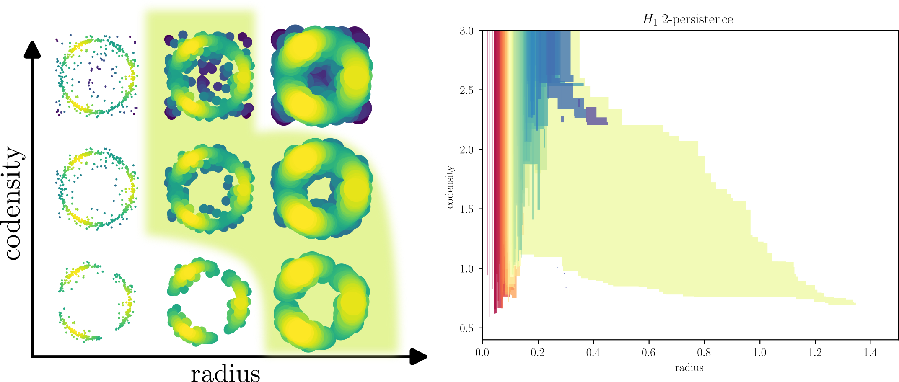

`multipers` : Multiparameter Persistence for Machine Learning
===============================================================

This library focuses on providing easy to use and performant tools for
applied **multi**\parameter **pers**\istence.
It is also meant to be integrated in the `Gudhi Library <https://gudhi.inria.fr>`_, 
so you can expect to see some similar implementations, for instance
the `SimplexTreeMulti <notebooks/simplex_tree_by_hand.html>`_.

Quick introduction to Multiparameter Persistence
************************************************

This library allows computing several representations from "geometrical datasets," e.g., point clouds, images, graphs, that have multiple scales.

A well-known example is the following one.
Pick a point cloud that has diffuse noise, or on which the sampling measure has some interesting properties, e.g., in the following example, the measure has three modes.

Then, one can define a two-parameter grid (filtration) of topological spaces (on the left) from a point cloud :math:`P` on which we compute the persistence of some topological structures (here cycles).

The filtration :math:`X`, indexed over a radius parameter :math:`r` and a codensity parameter :math:`s` is defined as follows:

.. math::
  X_{r,s} = \bigcup_{x \in P, , \mathrm{density}(x) \ge s} B(x,r) = { x\in \mathbb R^2 \mid \exists p \in P, \, \mathrm{density}(p) \ge s \text{ and } d(x,p) \le r }

The green shape on the left represents the lifetime of the biggest annulus. On the right, each cycle appearing on the left gets a colored shape (the color is only a label), and the shape of this colored shape represents the lifetime of this cycle in this two-parameter grid.

In our case, the big green shape on the left corresponds to the largest green shape appearing on the right, recovering the structure of the annulus here.

The magic part is that we never had to choose any parameter to remove the noise in this construction, but the annulus still naturally appears!

A more striking example is the following one.

Using the same constructions, we can identify topological structure, and their size, in a parameter-free approach, even when the majority of the signal is noise.

In this example, the shape associated with each cycle can be identified from:

 * Their radius: The smaller cycle will naturally live more on the "left" (smaller radius).
 * Their concentration: Cycles having more concentration will appear lower than others (smaller co-density).

Notice that this construction is also very stable with respect to noise. The more noise is added, the smaller the "rainbow strip" is, and the more the "large shape" (i.e., significant cycles) are visible.

.. image:: 2.png
  :alt: alt text

We also provide several other descriptors. In the following example from the same dataset, the Hilbert decomposition signed measure, the Euler decomposition signed measure, and the rank decomposition signed measure.

.. image:: 3.png
  :alt: alt text

Quickstart 
************
`multipers` is available on `PyPI <https://pypi.org/project/multipers/>`_, install it using

.. code-block:: bash

  pip install multipers

some dependencies are needed. The following ones should be enough.

.. code-block:: bash

  conda create -n python311
  conda activate python311
  conda install python=3.11 numpy matplotlib gudhi scikit-learn scipy tqdm shapely -c conda-forge
  pip install filtration-domination pykeops --upgrade

Not working ? Try installing it `from source <compilation.html>`_.

You are now ready to compute invariants on multifiltered topological spaces !

Citation
********

Please cite `multipers` if using it in a research paper. You can use the key 

.. code-block:: bibtex

  @misc{multipers,
      author={Loiseaux, David and Schreiber, Hannah},
      title={`multipers` : Multiparameter Persistence for Machine Learning},
      year={2022},
      publisher={GitHub},
      journal={GitHub repository},
      howpublished={\url{https://github.com/DavidLapous/multipers}}
  }

For theoretical references,
 - Module Approximation :cite:p:`mma`
 - Module Decomposition Representations :cite:p:`mma_vect`
 - Signed Barcodes as Signed Measures :cite:p:`sb_as_sm`

.. toctree::
  :caption: Introduction

  notebooks/multipers_intro
  notebooks/simplex_tree_by_hand
  compilation
  bibliography

.. toctree::
  :caption: Example zoo:
  
  notebooks/time_series_classification
  notebooks/graph_classification
  notebooks/molecular_embedding
  notebooks/degree_rips_interface

.. toctree::
  :caption: Differentiation

  notebooks/rips_density_autodiff
  notebooks/graph_autodiff

.. toctree::
  :caption: Modules and Functions tree
  :maxdepth: 2

  source/modules

Indices and tables
==================

* :ref:`genindex`
* :ref:`modindex`
* :ref:`search`

